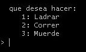
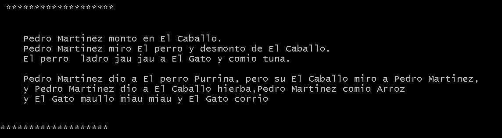

# Tutorial in python (pythonFiles)

## Running 
```
python input_practices.py
```


```
python cuento_ClassesPractices.py
```


### Description
```
*here you hace some tutorial in python (pythonFiles) that you can practices:

	* 1 classes
	* 2 inheritance
	* 3 metodos
	* 4 try except
	* 5 while
	* 6 not
	* 7 if elif else
	* 8 int()
	* 9 Dictionaries
	
```
